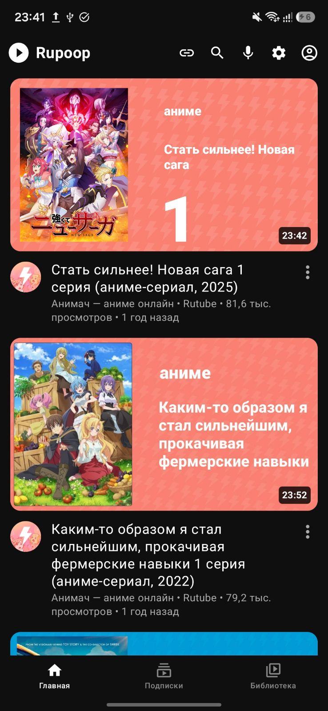
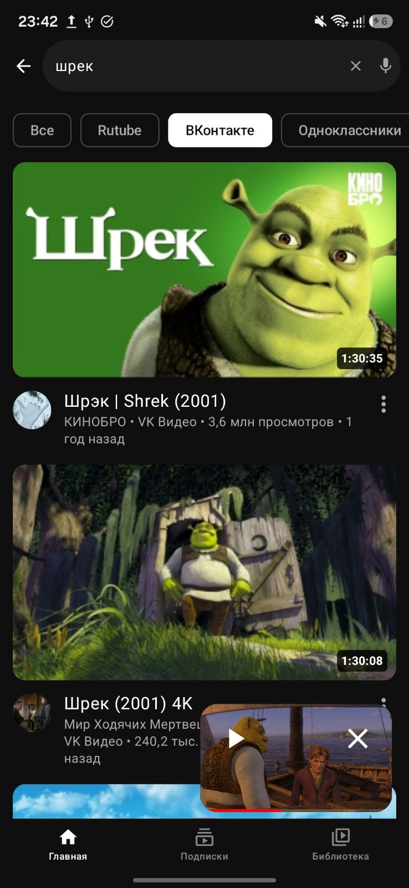
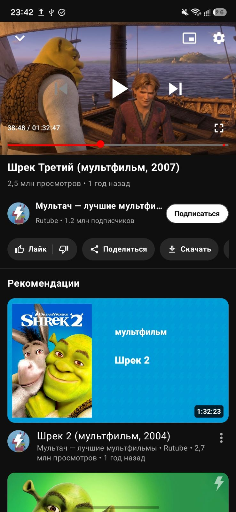
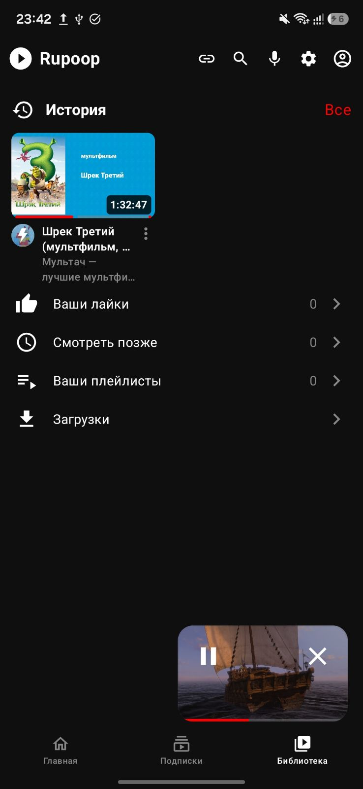
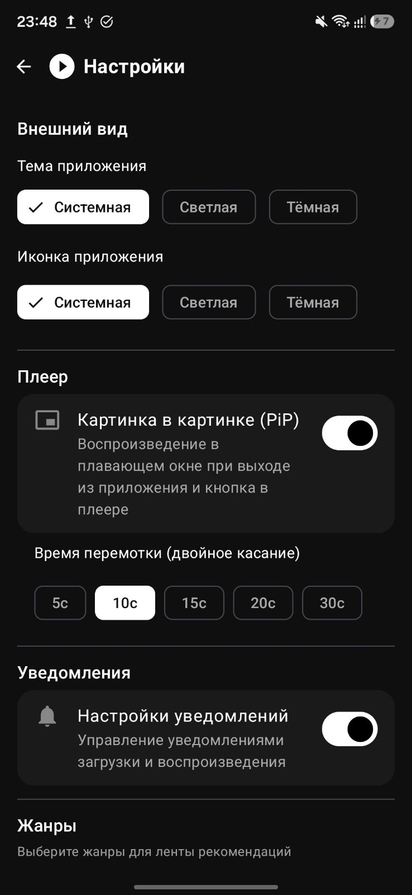

# 🎬 Rupoop — Мультиплатформенный видеоклиент без рекламы (Rutube, VK, OK, Lordfilm)

  

  
  
  

Быстрый, современный Android-клиент для бесплатного просмотра видео и фильмов **без рекламы** из **Rutube (рутуб/rutub/utube)**, **ВКонтакте (VK Видео/вк/vk)**, **Одноклассников (OK.ru/ок)** и **Lordfilm (лордфильм/lordfilm/сериалы)** с интерфейсом в стиле YouTube. Написан на Kotlin с использованием Jetpack Compose и Material 3. Поддерживает режим «Картинка в картинке» (PiP), фоновое воспроизведение и скачивание.

---

## ✨ Возможности

- 🎥 **Видеоплеер** — ExoPlayer (Media3) с HLS, качество до 1080p, управление жестами (двойной тап для перемотки, long press для 2x скорости)
- 🖼️ **Картинка в картинке (PiP)** — Воспроизведение видео в компактном плавающем окне поверх других приложений при сворачивании или по нажатию кнопки в плеере (с возможностью отключения в настройках).
- 🎬 **Мультиплатформенность и умные сиквелы** — Воспроизведение и поиск видео из **Rutube, VK Видео, Одноклассников и Lordfilm**. Интеллектуальный алгоритм поиска следующих серий, сезонов и сиквелов фильмов для всех 4 платформ: следующая серия всегда гарантированно выводится **первой** в рекомендациях под видео!
- 🏠 **Главная** — Персонализированный микс и умные рекомендации на основе истории просмотров и выбранных жанров в разнобой (как на YouTube) с параллельной загрузкой категорий.
- 🚫 **Скрытие контента** — Видео, помеченные как «Не интересно» или дизлайкнутые, гарантированно удаляются из всех лент, поиска, каналов авторов и подписок в реальном времени. В настройках доступен удобный раздел «Скрытые и неинтересные видео» для их разблокировки.
- 🔍 **Поиск** — Текстовый и голосовой ввод по Rutube, VK, OK и Lordfilm.
- 📺 **Подписки** — Подписывайтесь на каналы и следите за обновлениями (для Rutube доступен переход на страницу автора).
- 📚 **Библиотека** — История, лайки, «Смотреть позже», плейлисты, загрузки.
- ⬇️ **Скачивание** — Загрузка видео и аудиодорожек (m4a) с отслеживанием прогресса в приложении.
- 📻 **Фоновое воспроизведение** — Прослушивание видео в фоновом режиме с поддержкой системных элементов управления Media3 (даже при заблокированном экране).
- 🔔 **Управление уведомлениями** — Детальная настройка уведомлений для процессов скачивания и фонового воспроизведения.
- 🔄 **Синхронизация через GitHub Gist** — Все настройки, история просмотров, подписки и плейлисты автоматически синхронизируются в приватный Gist.
- 📲 **Перенос без аккаунта** — Быстрый экспорт и импорт всех настроек и данных на другой телефон через JSON-файл или системное меню «Поделиться» (Telegram, Quick Share, Bluetooth) вообще без необходимости входить в аккаунт!
- 🌙 **Темы** — Тёмная и светлая, переключение иконки приложения, пасхалки.
- 📢 **Telegram-канал** — [t.me/rupoopapp](https://t.me/rupoopapp) — здесь публикуются сырые, тестовые и бета-сборки приложения.
- 💝 **Поддержка** — Возможность поддержать разработчика.

---

## 🔍 Смотреть видео без рекламы на любых устройствах

Приложение создано для тех, кто ищет:
* 📺 **Смотреть Rutube без рекламы** — полноценная замена официальному клиенту рутуб со всеми видеороликами, шортсами и каналами.
* 🎥 **Смотреть VK Видео (ВКонтакте / ВК) без рекламы** — быстрый поиск и воспроизведение видеопотоков из VK.
* 👥 **Смотреть видео Одноклассники (OK.ru / ОК) без рекламы** — просмотр клипов, шоу и передач без рекламных интеграций.
* 🎬 **Смотреть Lordfilm (Лордфильм) бесплатно** — фильмы, сериалы и мультфильмы с выбором сезонов и серий прямо из встроенного каталога.
* 🖼️ **Режим «Картинка в картинке» (PiP)** и фоновое воспроизведение с выключенным экраном для всех поддерживаемых платформ.

---

## 📸 Скриншоты

  
  
  
  
  

  

---

## 🛠️ Сборка и архитектура

- 👉 **[Инструкция по сборке проекта (BUILDING.md)](BUILDING.md)** — требования, настройка `local.properties`, ключей и GitHub Actions CI/CD.
- 👉 **[Архитектура и структура кода (ARCHITECTURE.md)](ARCHITECTURE.md)** — описание модулей, слоев чистой архитектуры и SOLID-принципов.

---

## 🌐 Авторизационный Прокси-Сервер (Cloudflare Worker)

Для выполнения безопасной OAuth-авторизации через GitHub в приложении используется легковесный прокси-сервер, развернутый на платформе **Cloudflare Workers**. 

Исходный код прокси открыт и расположен в директории [`/server`](server/):
*   [`index.js`](server/index.js) — оптимизированный, высокопроизводительный JS-код воркера со встроенной **защитой от ботов** (белый список разрешает запросы только на роуты `/auth/token`, `/user` и `/gists`, блокируя сканеры мгновенно на уровне CDN с кодом `403 Forbidden`).
*   [`wrangler.toml.example`](server/wrangler.toml.example) — шаблон конфигурации для быстрого деплоя воркера через Wrangler.

### Зачем нужен прокси-сервер?
По спецификации OAuth 2.0 для обмена кода на `access_token` требуется передать секретный ключ приложения (`Client Secret`). Вшивать секретный ключ в клиентское Android-приложение **категорически запрещено**, так как злоумышленники могут легко извлечь его через декомпиляцию APK. Прокси-сервер скрывает `Client Secret` внутри безопасного окружения переменных среды Cloudflare, обеспечивая 100% безопасность авторизации.

---

## 🤝 Участие в разработке

Подробности в [CONTRIBUTING.md](CONTRIBUTING.md).

1. Fork → создайте ветку → внесите изменения → откройте PR
2. Используйте Kotlin code style
3. Описывайте коммиты на русском или английском

---

## 💝 Поддержать

Если проект полезен — поддержите разработчика:

- 💳 [**CloudTips** — быстрый перевод](https://pay.cloudtips.ru/p/1988b19b)

---

## 📄 Лицензия

[MIT License](LICENSE) © 2026 santiago43rus
